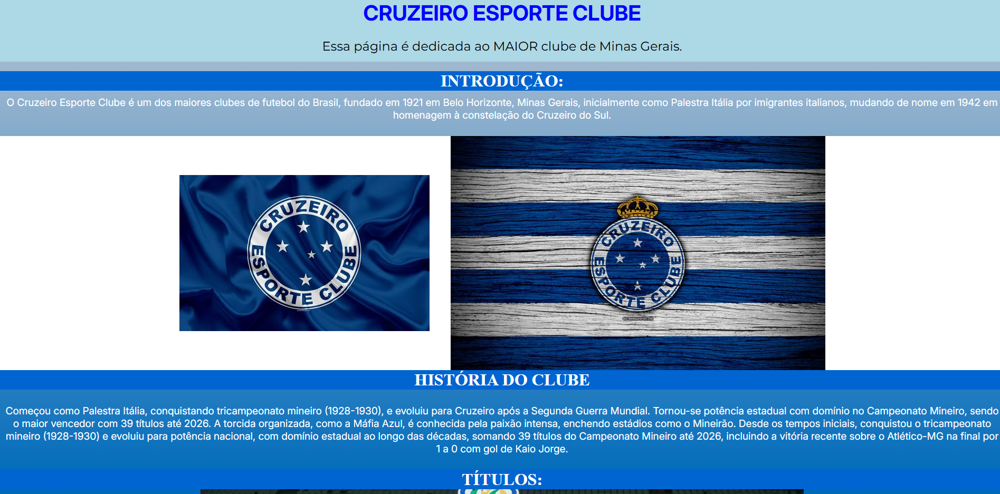

# Trabalho Prático - Semana 5

Dessa vez, vamos dar sequência ao projeto iniciado na semana passada. Se você ainda não fez o projeto da semana anterior, fique atento, se programe e procure colocar as atividades em dia. Volte lá, leia tudo e faça sua parte pois essa atividade depende da atividade anterior..

Nessa atividade,vamos evoluir o projeto para que a home-page funcione bem tanto no celular quanto no desktop, entendendo também como é o processo gradativo e colaborativo de desenvolvimento de um software, registrando cada etapa no histórico de commits do repositório do git/GitHub.

**IMPORTANTE:** Você deve trabalhar e alterar apenas arquivos dentro da pasta **`public`,** mantendo os arquivos **`index.html`** e **`styles.css`** com estes nomes. Deixe todos os demais arquivos e pastas desse repositório inalterados. **PRESTE MUITA ATENÇÃO NISSO.**

## Informações Gerais

- Nome: Lucas Dias Melo
- Matricula: 927740
- Proposta de projeto escolhida: Webpage voltada a informações sobre o Cruzeiro Esporte Clube
- Breve descrição sobre seu projeto: O projeto se baseia em uma breve aba de informações sobre o clube de futebol Cruzeiro, contendo informações sobre histórias e alguns títulos (inicialmente), em breve mais informações serão adicionadas.
>>>>>>> a15477f (Alterações com Boostrap Iniciais)

## Print da versão responsiva com CSS puro [DESKTOP]

## Print da versão responsiva com CSS puro [MOBILE] (*)

(*) Utilize as ferramentas do desenvolvedor do seu navegador para colocar no modo reponsivo, escolha um celular qualquer e recarregue a página antes de tirar o print. 
=======

